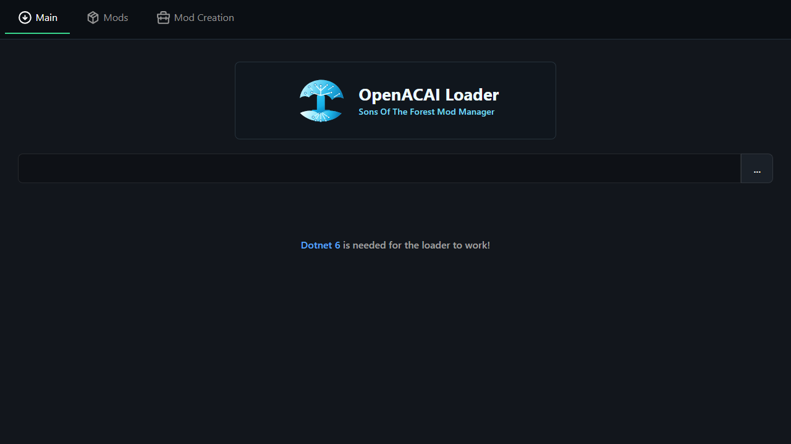

# OpenACAI Mod Manager

[](LICENSE)
[](https://tauri.app/)
[](https://store.steampowered.com/app/1326470/Sons_Of_The_Forest/)

Developer: Alex Cooper

OpenACAI Mod Manager is a Tauri 2/Svelte 5 manager for installing and maintaining the OpenACAI Endnight Loader package for Sons of the Forest.

It is based on Toni Macaroni's RedManager, but the main loader flow has been changed for the OpenACAI-maintained Endnight-specific loader:

- Select and install a local `OpenACAILoader.zip`.
- Install or repair the latest public OpenACAI Endnight Loader package from GitHub Release assets using a signed-by-hash update manifest.
- Verify loader-owned files with SHA256 before launching the game, and keep a cached last-known release manifest for offline comparison.
- Recheck loader health when the selected game executable changes so the displayed status and repair target follow the active folder.
- Detect whether installed mods are RedLoader packages, RedLoader libraries, BepInEx plugins, native-store installs, manual installs, or Nexus/Vortex-managed packages.
- Browse the live SOTF Mods storefront inside the unified Mods workspace, including an All Stores mode that keeps SOTF Mods and Nexus/Vortex in one shared search surface with balanced source preview panes, bottom safe-area scroll spacing, a measured Nexus bottom scroll guard that keeps row actions above the lower frame while scrolling, compact connected Nexus account controls in tight catalog layouts, category, type, compatibility, stale-request-safe shared search clearing, result counts, measured compact list rows, and installed/online filters that mirror the real store taxonomy.
- Search and filter installed SOTF Mods entries locally without being bounced back to the online catalog.
- Enable or disable installed native/manual mods from the manager with source-aware checkboxes; Vortex-managed packages are detected but left read-only so Vortex deployment metadata is not corrupted.
- Switch the unified Mods workspace to Nexus/Vortex while keeping the shared Mods workspace search term, connect a Nexus Mods account through the Nexus browser SSO flow where available, use a manual API token fallback for testing stored locally in the OS credential vault, and browse Nexus/Vortex-side Sons Of The Forest mods with cross-store install status.
- Preview Nexus catalog row images with compact count/cycle controls and open already-loaded real preview images directly without adding Nexus API requests; rows also reuse already-loaded detail preview URLs after a drawer discovers author-supplied images in descriptions, file notes, or changelogs, even when a Nexus detail payload omits its mod ID.
- Open Nexus mod detail pages inside the manager to read author directions with safe BBCode/HTML formatting preserved, including authored heading/list/table/indent layout, naked BBCode list-item runs, authored unordered marker styles, inferred and indented plain lists, ordered-list start numbers, dense line-layout blocks, real BBCode/HTML definition lists, BBCode list-item variants, table spans, safe table width/alignment hints, labeled divider sections, loose/cell-only/partially closed table-row recovery, single-line structural breaks, simple alignment/color/highlight, legacy `centre`/`colour`/strikethrough/newline aliases, safe font-family hints, floated/aligned/standalone image aliases, image alt/title hints, semantic abbreviation/citation/inline-quote hints, quote citations, labeled pre/code blocks, clear markers, anchor/bookmark references, whitespace cues, column/tab/callout fallbacks, standalone media blocks for supported video/embed/audio/object markup, and malformed-list recovery, jump between local detail sections from a compact in-drawer rail, choose a specific file from a recommended-first file list with compact selected/review-state chips plus All/Main/Review/Selected filters, recover from archived/old file choices with a `Use Recommended` shortcut and bottom file-review jump, inspect API-listed dependencies for that file, use responsive drawer sizing that gives Files, selected-file notes, Dependencies, and Changelog larger readable regions before deployment, hand the selected file to Vortex through the `nxm://` protocol, copy the generated Vortex link as a fallback, and use status-badged Nexus surface links for Description, Files, Images, Posts, and Bugs so API-backed content is distinguished from Nexus-only community pages.
- Resolve API-listed Nexus file dependencies against the local Sons Of The Forest inventory, falling back from materialized dependency candidates to range definitions when needed, accepting alternate wrapped/camelCase/edges/nodes dependency payload shapes without extra broad API calls, and surfacing author requirement hints from the Nexus description, selected-file notes, and changelog text when structured dependency rows are missing or incomplete. These hints include author links plus local-only runtime/library phrase detection for requirements such as BepInEx, RedLoader, SonsSdk, Harmony, .NET, or OpenACAI loader support, with source labels and matched-text snippets so review hints are auditable. Incompatibility, removal, or conflict wording is shown as an author warning instead of a satisfied dependency. The dependency drawer, section rail, and install-plan facts summarize API rows, warning/review/detected author hints, and nested dependency checks at a glance before Vortex handoff. A capped user-triggered nested dependency check can follow returned dependency file IDs, showing installed, missing, and version-review states with direct in-manager details, Nexus, and folder actions where the API/local metadata supports them.
- Preview a selected Nexus file's install plan before Vortex handoff, including inferred or user-selected target placement, action type, file category, API dependency lookup state, author instruction snippets, author requirement review/detected hints, nested dependency check readiness, local conflict state, archived-file review state, and Vortex deployment detection; after handing a file to Vortex, refresh local inventory from the account row or detail deployment footer without making extra Nexus requests.
- Display Nexus premium/supporter/tier status returned by the account validation API with local-token/cache and Nexus/Vortex download-handoff context, show existing endorsements for downloaded SOTF mods, and let users manually endorse downloaded mods from the online, detail, and installed inventory views.
- Track or untrack Nexus-hosted SOTF mods from the manager, filter the catalog to tracked mods, and review API-listed changelog entries plus semver-aware local update state for installed matches.
- Detect local duplicate/conflict groups across Nexus IDs, manifest names, local package IDs, and Vortex package labels, with a dedicated Conflicts filter, conflict review panel, direct Review Conflict actions from conflicted rows/detail drawers, and detail-drawer conflict panel for matched Nexus entries, including Nexus detail drill-down for conflict rows that carry a Nexus mod ID.
- Triage the Nexus/Vortex catalog with attention, update, disabled, tracked, endorsement-needed, source, mod-type, and conflict filters plus separate online/installed sort modes, clickable health summary cards, an action-queue strip that collapses to a slim clear state when all queue counts are zero, a visible manual-refresh cooldown, persisted local UI filters, and a clear-filters control.
- Confirm Nexus account writes before tracking/untracking, manual endorsement, or enabling auto-endorse; optional auto-endorse only targets Vortex-managed SOTF downloads with a local user toggle, queue/attempt visibility, once-per-mod attempt tracking, and a small per-refresh cap so the manager does not create excessive Nexus API traffic.
- Detect the OpenACAI Endnight Loader core assembly through `BepInEx\plugins\OpenACAILoader`.
- Keep old RedLoader/MelonLoader cleanup affordances so users can avoid competing loader bootstraps.
- Present the manager in a frameless, transparent Sons-style shell with rough/jagged edges, Endnight splash-logo styling, and native-feeling chromatic text effects instead of a standard Windows app frame.

This public manager does not include the private OpenACAI anti-cheat/admin mod.

Brand asset provenance is documented in `BRANDING.md`.
Upstream/fork lineage is documented in `UPSTREAMS.md`.

## Screenshots



## Prebuilt Downloads

The current Windows builds are published as GitHub Release assets and mirrored in `prebuilt/` for direct repository downloads:

- [Latest GitHub release](https://github.com/desertofunknown/openacai-mod-manager/releases/latest)
- [Windows portable executable](prebuilt/OpenACAI-Mod-Manager-0.2.0-x64-portable.exe)
- [Windows setup executable](prebuilt/OpenACAI-Mod-Manager-0.2.0-x64-setup.exe)
- [OpenACAI icon](prebuilt/OpenACAI-Mod-Manager.ico)
- [SHA256 checksums](prebuilt/SHA256SUMS.txt)

These builds are signed with the OpenACAI Inc Azure Trusted Signing certificate. Windows SmartScreen and some browsers may still warn while publisher reputation builds. Verify the SHA256 checksum and Authenticode signature before release. Code-signing guidance is documented in `SIGNING.md`.

GitHub release assets should mirror this folder when tagged releases are created. MSI builds are intentionally not published while the current MSI launch issue is investigated.

Local test-copy workflow is documented in `LOCAL_TESTING.md`.

## Development

```powershell
npm ci
npm run check
npm run build
npm run tauri build
```

For the desktop shell:

```powershell
npm run tauri dev
```

## Storefront Notes

The top-level Mods tab is a unified workspace with an `All Stores` mode plus dedicated source views for `SOTF Mods` and `Nexus / Vortex`; the last selected source is restored locally. All Stores stacks both storefronts in one shared search surface so users can browse and use install/download actions from either source without leaving the Mods tab, and its source preview panes are balanced so the second storefront is visible sooner instead of being buried below a full-height first catalog. The Mods workspace and nested catalog scrollers reserve bottom safe-area spacing so final rows, preview images, and install/open actions can scroll above the ragged lower frame edge instead of being clipped by the transparent window bleed. A shared Mods workspace search box drives the active source or both All Stores sections, persists locally, carries the term across source switches, and hides duplicate embedded search fields so users can search once before choosing which store to browse. The SOTF Mods source reads from the live SOTF Mods API and currently supports the public storefront categories `Library`, `Misc`, `Model Swap`, and `Quality of Life`, plus type filters for mods, libraries, and builds. Search and compatibility filters update the visible list reactively, while online search still debounces API reloads for typed queries; clearing the shared search invalidates older SOTF online requests and immediately reloads the unfiltered catalog so stale empty results cannot win the race. The Clear control resets search/category/type/compatibility filters without changing the active online or installed mode. The SOTF Mods source measures its available page height, gives the catalog scroller the remaining space, and uses dense horizontal rows with fixed thumbnail/action columns so more mods stay visible while retaining preview images. A compact status strip shows visible rows, loaded/installed rows, category count, and active-filter state.

The Nexus/Vortex source uses the Nexus Mods API for account validation, Sons Of The Forest game/category metadata, mod feeds, mod details, file choices, file dependency metadata, changelogs, tracked mods, and user endorsement state. Nexus category filters are sourced from the game metadata endpoint when available, with a local Sons Of The Forest taxonomy cache (`Gameplay`, `Miscellaneous`, `Visuals`), canonical alias matching for common category labels, and inferred per-mod fallbacks for feed records that omit category data; rows and detail headers mark local-taxonomy or inferred category sources when the source is not direct API metadata. File choices are sorted with the recommended/main handoff first, while archived/old/removed files are badged for review before Vortex handoff; compact chips summarize total files, the selected file, and review-only file categories before the user scans every row, and All/Main/Review/Selected filters keep mixed file sets readable in shorter drawers. If an archived, old, or removed file is selected, the Files panel exposes `Use Recommended` and the bottom deployment footer exposes `Review File Choice` so the user can jump back before sending the file to Vortex. When Nexus returns file-specific descriptions or changelog HTML, the selected file shows a safe formatted notes panel beside the file list before deployment. Selected-file dependencies are compared against the local mod inventory so missing dependencies and version-review cases are visible before handing a file to Vortex; dependency lookups use materialized dependency candidates first, then fall back to range definitions when Nexus exposes ranges instead, accept alternate wrapped/camelCase/edges/nodes payloads returned by supported dependency surfaces, and show range requirements as review metadata rather than false exact-version mismatches. The dependency box summarizes API dependency rows, author requirement hints, and nested check readiness in compact chips so missing/review states stay visible before the user scans every row, and the deployment footer exposes a dependency review shortcut when API rows, nested rows, or author hints need attention. Dependency rows with Nexus IDs use status-aware `Install`, `Update`, `Review`, or `Details` actions that open the in-manager dependency drawer before any Vortex handoff. When Nexus does not return structured dependency rows, the detail drawer also surfaces high-confidence requirement links and local runtime/library phrases already present in API-provided author text, selected-file notes, or changelog text, such as SOTF Nexus dependency links, BepInEx, RedLoader, SonsSdk, Harmony, .NET, or OpenACAI loader mentions, without making extra requests. Runtime/library phrase hints are compared against the local inventory and shown as Detected, Review, or Compatibility warning rather than pretending to be API dependency rows; inferred hints include their source location plus a compact matched-text excerpt for manual review, and incompatibility/removal wording is kept as a warning even when a related local install is detected. Dependency rows that include a Nexus mod ID can open their own in-manager detail drawer with a Back control. A deliberate `Check Nested` action can query up to eight returned dependency file IDs across two nested levels, using cached/user-triggered Nexus dependency calls instead of automatic broad crawling. Nested findings reuse the same local inventory resolver and install-plan notes. The detail drawer also previews an install plan for the chosen file, including inferred or user-selected Sons target placement, action type, file category, file ID/version/uploaded date/size, dependency/conflict review notes, author requirement review/detected notes, Vortex deployment metadata state, and local conflict remediation when the selected Nexus mod maps to a duplicate local install group. The placement selector can leave the target on Auto or explicitly mark the file as a BepInEx plugin, RedLoader mod, RedLoader library, or manual-review handoff before generating the Vortex plan. The install plan also surfaces compact author instruction snippets for likely install, configuration, usage, warning, and requirement text already returned by the API, with each snippet jumping back to its source section. The bottom deployment footer adds a compact checklist for File, Deps, Target, and Deploy readiness; each item jumps back to its detail section so users can review file choice, dependencies, placement, or deployment state before sending the NXM handoff to Vortex. The chosen file's generated `nxm://sonsoftheforest/...` link is shown in the drawer and can be copied locally as a Vortex protocol fallback without making extra Nexus calls. A local-only `Refresh Inventory` action is available in the Nexus account row and detail deployment footer so users can rescan Vortex/native/manual install state after finishing deployment in Vortex without hitting Nexus again. The installed inventory derives local duplicate/conflict groups from Nexus IDs, manifest names, package IDs, and Vortex package labels without extra Nexus calls; installed Nexus/Vortex rows can open the same detail drawer from local inventory, and the Local Conflicts shortcut now switches to installed inventory and opens a review panel with grouped installs, source/type/location/version detail, folder actions, optional Nexus detail actions where local metadata carries a Nexus ID, and source-aware enable/disable controls for each conflicting entry. Vortex-managed entries remain read-only in this manager. Attention, update, disabled, tracked, endorsement-needed, source, mod-type, and conflict filters plus online/installed sort modes and a clear-filters control help surface rows that need action before the user scans the full list; these category, install-state, and mod-type filters show live result counts against the other active filters, and the online-only category selector is disabled in installed inventory. The mod-type facet covers BepInEx plugins, RedLoader mods, RedLoader libraries, Nexus/Vortex-managed installs, OpenACAI native installs, and manual/local installs. A compact action queue summarizes endorsement candidates, tracked missing mods, updates, disabled installs, and local conflicts, and each queue chip jumps to the matching filter. Update state comparisons normalize common semver shapes such as `v1.0` versus `1.0.0`, separate remote-newer updates from local-newer or ambiguous version-review cases, and expose the comparison reason in row/detail tooltips. Installed Nexus/Vortex rows reuse user-fetched detail/file metadata for their update verdicts, preferring the recommended file version when the feed-level mod version is coarse. The Nexus/Vortex source persists the last catalog mode, search, category, install filter, mod-type filter, and sort choices locally so reloads return to the same triage context, and the API note shows when the current Nexus catalog was loaded. Account cards display premium/supporter/tier fields when Nexus exposes them, with context that download entitlement, speed, and queue behavior remain handled by Nexus/Vortex and that tokens stay local while requests are cached. Tracking, untracking, manual endorsement, and enabling auto-endorse all require an explicit local confirmation before the manager sends a Nexus account write. Endorsement actions are limited to user-installed/downloaded mods, and the optional auto-endorse setting only targets Vortex-managed installs with Nexus mod IDs, shows pending/attempted queue state locally, remembers attempted IDs locally, and caps itself at three attempts per refresh. Public Nexus specs currently do not expose comments or gallery/media endpoints for this flow, so the detail drawer's Nexus surface links badge Description, Files, and Images with available in-manager data while keeping Posts and Bugs as Nexus-only links instead of scraping them. Browser SSO needs a Nexus-approved application slug; until `openacai-mod-manager` is registered by Nexus Mods, the advanced manual token path is only for development/testing builds.

The Nexus catalog and detail drawer use measured available space to keep the mod list, files, dependencies, and changelog from collapsing into tiny panes. When the measured Nexus mod-list pane is short, the catalog now switches into a tight density that compresses account/status chrome, queue chips, filters, thumbnails, and row copy together so more mod rows stay visible without covering the install/open actions. Compact detail drawers keep the mod name, preview image, and formatted author description first, add a local section rail for jumping to Description, Files, Dependencies, Install Plan, Changelog, and Deployment, give Files/selected-file notes/Dependencies/Changelog larger responsive regions, stack the drawer earlier on medium-width windows, and collect install/track/open actions in a bottom deployment footer whose page-section links wrap below the primary actions instead of squeezing them; long descriptions use a header-level expandable preview so the drawer remains readable at shorter window heights. The Nexus text renderer preserves safe BBCode/HTML structure for descriptions, changelogs, and selected-file notes, including heading levels, emphasis, nested ordered and unordered lists, ordered-list start numbers, naked BBCode list-item runs, authored unordered marker styles, inferred plain bullet/number/letter lists with indentation kept as nested lists, BBCode `[li]`, real `[dl]`/`[dt]`/`[dd]` definition-list layouts, and labeled `[*=...]` list-item variants, malformed-list recovery, single-newline structural blocks, dense line-layout blocks with stronger monospace spacing, multi-paragraph quotes, native expandable spoiler/details/collapse/accordion sections, alignment, indentation, float, clear markers, and code blocks, column/tab/callout/box/collapsible layout fallbacks, captions, definition-list fallbacks, row/cell table aliases, loose, cell-only, or partially closed table-row recovery, table cell width/alignment hints, author divider lines with optional labels, standalone section labels, styled HTML spans/divs with safe font-family hints, semantic abbreviation/citation/inline-quote hints, simple HTML/rgb color, highlight/background spans, relative size hints, legacy `centre`/`colour`/strikethrough/newline aliases, floated/aligned/standalone image aliases with responsive fallbacks, image alt/title hints, light whitespace preservation, pre/code blocks, rules/dividers, attribute-style links/images, protocol-relative rich-text URLs, bounded inline images, generated tables with safe cell spans, inline media-link fallbacks, and standalone media blocks for supported video/embed/audio/object markup while escaping unsupported markup. Catalog rows keep compact preview images at shorter window heights, accept protocol-relative and common nested media URL fields from Nexus payloads, show compact image-count/cycle controls, and use a bundled local fallback image when Nexus does not provide a usable preview URL. Catalog rows and detail drawers can cycle through multiple API-provided preview URLs when Nexus includes them in feed or detail payloads; detail drawers also show a compact thumbnail rail for quick direct selection, icon next/previous controls for multi-image sets, and a current-preview open action for single-image and multi-image detail media. Detail media falls back to the catalog preview before showing the bundled local fallback, and detail preview rails also reuse safe image URLs found in API-provided author descriptions, selected-file notes, and changelogs without making extra Nexus requests. Dependency checks preserve a Nexus v3/global file ID whenever the file or dependency payload exposes one, then fall back through game-scoped ID resolution and the original Vortex/NXM file ID before requesting materialized or range dependency metadata.

The rich-text renderer also converts common Nexus author-layout shorthand such as `[thumb]`/`[thumbnail]` image aliases, standalone `[img=...]` media tags, relative Nexus links, spaced labeled list markers, indented plain list runs, ordered lists that start after `1`, anchor/bookmark/jump references, simple pipe-separated or BBCode-cell-only note tables, table cell width/alignment hints, labeled horizontal-rule sections, codebox/plain/fixed preformatted aliases, hidden/spoilerblock aliases, legacy horizontal-rule tags, relative/point size hints, HTML/CSS list marker styles, malformed nested closing tags, and monospaced column-style line blocks into safe drawer markup so descriptions retain more of the author's intended reading order and spacing.

Nexus API usage must follow the [Nexus Mods API Acceptable Use Policy](https://help.nexusmods.com/article/114-api-acceptable-use-policy). This manager sends consistent `Application-Name`, `Application-Version`, and User-Agent metadata, stores user tokens locally instead of on OpenACAI servers, caches Nexus feed/session/detail/file calls for 10 minutes, shows hourly/daily rate-limit meters from the API headers, and rate-limits manual refresh clicks with a visible cooldown to avoid excessive API traffic. It must not bulk scrape, rehost Nexus data, impersonate another application, or ship as a public-facing app that relies on personal API keys instead of a registered Nexus application slug.

The intended Nexus registration path for `openacai-mod-manager` is to use GraphQL for public/read-heavy metadata and supported community surfaces, OAuth2/PKCE for the public desktop login and user-initiated authenticated actions, and legacy REST/v1 only where current mod-manager capabilities are not yet available through GraphQL or OAuth-backed APIs.

To refresh prebuilt files and the ignored local portable test executable:

```powershell
.\scripts\refresh-prebuilt.ps1 -Build
```

## Licensing

OpenACAI-authored manager changes are licensed under `GPL-3.0-or-later`.

The original RedManager project is licensed under `Apache-2.0`; its license text is preserved in `LICENSES/Apache-2.0.txt`, and attribution is preserved in `THIRD_PARTY_NOTICES.md`.

The OpenACAI Endnight Loader packages managed by this app are built on BepInEx and RedLoader/SonsSdk components. Their LGPL notices are preserved by the loader package and called out in this manager's third-party notices. The Main tab links to the public loader repository at `https://github.com/desertofunknown/openacai-loader`.

Selected Sons of the Forest UI textures, splash logo textures, and font assets are bundled into the Tauri frontend so they are not distributed as loose external runtime files. Those assets remain copyright property of Endnight Games and are included only for this open-source, noncommercial Sons of the Forest mod-management integration. They are not available for commercial reuse.
